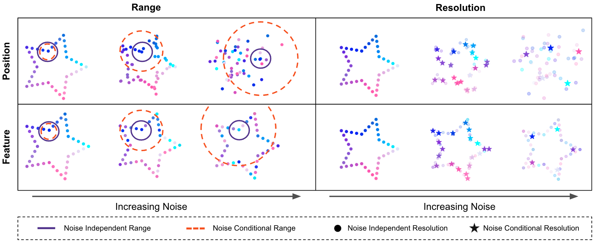

# Noise Conditioned Graph Networks
Official code for [Geometric Generative Modeling with Noise Conditioned Graph Networks](http://arxiv.org/abs/2507.09391) by Peter Pao-Huang, Mitchell Black, and Xiaojie Qiu. 

**Noise Conditional Graph Networks (NCGNs)** are a new class of graph neural networks for more efficient and expressive generative modeling.

The repository contains all scripts and settings to setup, run, and recreate experiment results from the paper.

Please reach out to peterph@stanford.edu with any comments or issues. 



## Getting Started
### Installation
```
conda create -n ncgn python=3.12
conda activate ncgn
pip install torch==2.4.1 torch_geometric==2.6.1
pip install torch-cluster==1.6.3
pip install diffusers[torch]==0.33.1 timm==1.0.15 accelerate==1.6.0 torchcfm==1.0.7 

<!-- Required Packages for DiT-DMP -->
pip install einops==0.8.1 datasets==3.1.0 pillow==10.4.0 tensorflow==2.19.0
pip install natten==0.17.5+torch260cu126 -f https://shi-labs.com/natten/wheels/
```
Ensure CUDA is available using `python -c 'import torch;print(torch.cuda.is_available())'`.

## Overview of Repo
* Directory `src` hosts all code for NGCNs
* Directory `experiments` hosts all code to run experiments that are reported in the paper
* Directory `data` hosts the spatial transcriptomics data reported in the paper
* Directory `adaptations` hosts the DMP adaptation of DiT model

## Experiments

### ModelNet40 Point Cloud Generation

Train point cloud generation models on ModelNet40 dataset:

```bash
python -m experiments.modelnet_train [args]
```

Evaluate the trained models:

```bash
python -m experiments.modelnet_test [args]
```

Key arguments:
- `--gnn_type`: Choose from 'knn', 'long_short', or 'dmp'
- `--model_type`: Message passing type - 'GAT' or 'GCN'
- `--dmp_schedule`: Choose from 'linear', 'relu', 'log', 'exp'

### Spatial Transcriptomics Generation

Train models on synthetic spatial transcriptomics:

```bash
python -m experiments.st_train [args]
```

Evaluate models with various tasks:

```bash
python -m experiments.st_test [args]
```

Key arguments:
- `--gnn_type`: Choose from 'knn', 'fully_connected', or 'dmp'
- `--model_type`: Message passing type - 'GAT' or 'GCN'
- `--dmp_schedule`: Choose from 'linear', 'relu', 'log', 'exp'
- `--task`: Choose from:
  - 'unconditional': Unconditional generation
  - 'forward_sim': Forward simulation prediction
  - 'interpolation': Temporal interpolation
  - 'gene_imputation': Gene imputation
  - 'space_imputation': Spatial point imputation
  - 'knockout': Gene knockout analysis

### Image Generation (Adapting DiT to DMP)

Train DiT-DMP on ImageNet:

```bash
torchrun --nnodes=1 --nproc_per_node=N adaptations/DiT_dmp/train.py --model DiT-DMP-S/4
```

Generate samples from DiT-DMP:

```bash
torchrun --nnodes=1 --nproc_per_node=N adaptations/DiT_dmp/sample_ddp.py --model DiT-DMP-S/4 --num-fid-samples 50000 --ckpt results/000-DiT-DMP-S-4/checkpoints/0800000.pt
```

Calculate evaluation metrics between ground truth and generated samples:

```bash
python adaptations/DiT_dmp/evaluator.py --ref_batch adaptations/DiT_dmp/VIRTUAL_imagenet256_labeled.npz --sample_batch samples/DiT-DMP-S-4-0800000-size-256-vae-ema-cfg-1.5-seed-0.npz
```
where the reference set can be downloaded via
```
wget -P adaptations/DiT_dmp/ https://openaipublic.blob.core.windows.net/diffusion/jul-2021/ref_batches/imagenet/256/VIRTUAL_imagenet256_labeled.npz
```

## License
MIT

## Citation
```
@inproceedings{
pao-huang2025geometric,
title={Geometric Generative Modeling with Noise-Conditioned Graph Networks},
author={Peter Pao-Huang and Mitchell Black and Xiaojie Qiu},
year={2025},
booktitle={Forty-second International Conference on Machine Learning},
}
```
